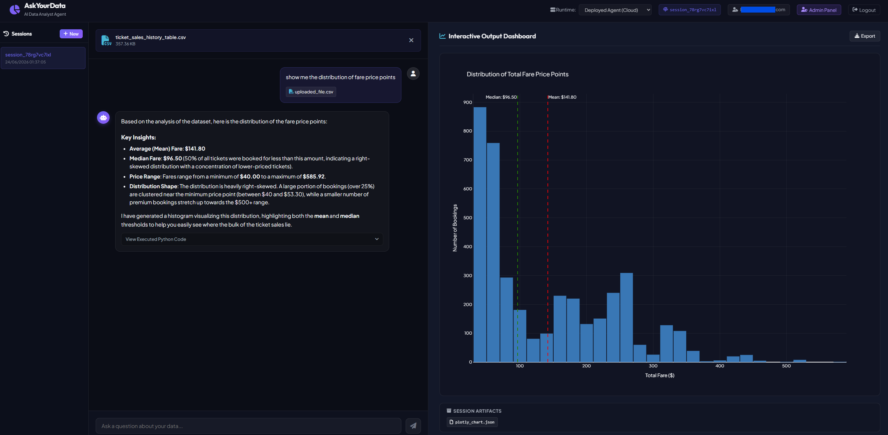

# Ask-Your-Data Analyst Genie 📊🤖

[](https://github.com/LaurentVeyssier/Ask-your-data-genie/actions/workflows/deploy-to-prod.yaml)



An intelligent, secure, and feature-rich data analysis web application powered by a Gemini ReAct agent. Users can upload CSV files, perform complex mathematical or statistical operations, generate premium interactive Plotly visualizations, and chat with their files in natural language.

The application implements full user authentication (email + password), persistent multi-device sessions, automatic GCS/Firestore cleanups, and a glassmorphic Administrative Control Panel for user and system management.

---

## ✨ Features & Architecture

### 1. 🤖 ReAct Analyst Agent
- **Powered by GenAI SDK**: Implements the modern `google-genai` client for prompt processing and tools invocation.
- **Isolated Subprocess Code Execution**: Executes generated Python code in a separate `spawn` process (via [FileSavingLocalCodeExecutor](app/local_executor.py#L73)), capturing stdout and generated file artifacts (like Plotly figures) dynamically. System-level sandbox isolation is offloaded to the container layer (Docker/Cloud Run).
- **Automated Data Profiling (ADK Pre-processing)**: When a new CSV file is uploaded, the ADK framework automatically triggers an exploration step before the agent begins reasoning. It runs an isolated python script (`explore_df`) in the sandbox to extract the data schema, column types, row counts, and preview unique values. This context is automatically injected into the LLM prompt context, allowing the agent to plan and write code correctly on the very first turn.
  - **Session-Scoped Caching**: Within the same conversation thread, profiling results are saved in the persistent session state (even across logouts and logins). Subsequent messages instantly reuse this context, bypassing re-execution and eliminating extra LLM queries.
  - **New Session Separation**: For data privacy and security, starting a new chat thread (session) initializes a clean slate. Uploading the same file in a new thread will trigger a one-time profile run to initialize that session's isolated cache.
- **Interactive Visualizations**: Generates rich dynamic graphics, exporting output directly as interactive [Plotly](https://plotly.com/javascript/) charts rendered seamlessly on the frontend.
- **Ephemeral Shareable Dashboards ([here.now](https://here.now) Integration)**: With a single click on the "Share" button, users can securely publish their latest analysis insights and accompanying Plotly graphic as a standalone, beautifully styled dashboard. Powered by [share_service.py](app/app_utils/share_service.py).
  - **Dynamic Layout Toggling**: The shared dashboard provides a responsive layout-toggle button, allowing viewers to switch instantly between a side-by-side **Split View** and a vertical **Stacked View**. Plotly charts dynamically resize automatically to occupy optimal visual real estate.
  - **24h Expiration & Claim Link**: Anonymous shared dashboards expire automatically after 24 hours. The publisher is also provided with a unique **Claim URL**, allowing them to authenticate on `here.now` to retain, update, password-protect, or delete their shared page.

### 2. 🔐 User Authentication & Security
- **Secure Credentials**: Hashes and verifies passwords securely using **bcrypt**.
- **JWT Session Tokens**: Signs and validates session states using **PyJWT** (HS256 algorithm) stored locally in browser storage.
- **Glassmorphic UI**: Beautiful signup and login overlays styled using modern dark-theme glassmorphism and subtle animations.

### 3. 💾 Hybrid Session Persistence & Recovery
- **Local Developer Mode**: Zero-configuration runs utilizing **SQLite** (`local_users.db`) for user credentials and an in-memory session engine.
- **Production Mode (Hybrid Store)**: 
  - **Firestore (Native)**: Stores lightweight user account records and session metadata documents to keep database reads/writes extremely fast.
  - **GCS Offloading**: Large multi-turn conversation event logs (which contain Python code execution strings, base64 file payloads, and data summaries) are saved as type-safe JSON files in **Google Cloud Storage (GCS)**. This completely bypasses Firestore's 1,500-byte Native Mode indexing limit and standard JSON byte serialization errors.
- **Complete Workspace Recovery**: Instantly reconstructs chat history turns, collapsible executed Python code accordions, and fully interactive Plotly graphics when returning to past sessions (supporting fallbacks for legacy Firestore events).

### 4. 🧹 Automatic & Manual 7-Day Purging
- Background FastAPI tasks automatically identify and clean up sessions, artifacts, and GCS storage objects older than 7 days.
- Admins can trigger manual sweeping runs on-demand.

### 5. 🛡️ Admin Control Panel (RBAC)
Designate a primary administrator via environment variables to gain access to a dedicated dashboard modal containing:
- **Users Portal**: Lists all registered accounts, shows registration dates, and supports role promotion or demotion.
- **Active Sessions Monitor**: Real-time listing of active sessions across the entire system. Allows admins to force-terminate and delete storage artifacts for any session.
- **Stats & System Control**: Glowing analytics cards (counters for total users, active sessions, admins), database backend details, and manual broom triggers.

---

## 📁 Project Structure

```
ask-your-data/
├── app/                     # Core application source
│   ├── app_utils/           # Helpers and database models
│   │   ├── auth_service.py      # BCrypt hashing, JWTs, SQLite/Firestore UserStore
│   │   ├── firestore_session.py # Hybrid GCS/Firestore session persistence engine & GCS purging
│   │   ├── share_service.py     # Ephemeral here.now sharing client & standalone HTML generator
│   │   ├── telemetry.py         # Google Cloud Trace and metrics setup
│   │   └── typing.py            # Pydantic telemetry & feedback schemas
│   ├── static/              # Frontend web application assets
│   │   ├── app.js               # UI controller, Plotly renderer, Admin/Share API clients
│   │   ├── index.html           # Glassmorphic layout, chat panels, admin & share modals
│   │   └── style.css            # Custom CSS tokens, animation keyframes, scrollbars
│   ├── agent.py             # Agent prompt logic and tools registry
│   ├── fast_api_app.py      # FastAPI routing, security dependencies, admin & share endpoints
│   └── local_executor.py    # Isolated subprocess code runner (sandbox offloaded to container)
├── tests/                   # Automated validation suite
│   ├── eval/                # Systematic evaluation suite (ADK)
│   │   ├── datasets/            # Target evaluation JSON datasets
│   │   └── eval_config.yaml     # Custom LLM-as-judge metrics & run settings
│   ├── integration/         # Server and Agent end-to-end tests
│   └── unit/                # Core unit logic tests
├── .env.example             # Template for developer configuration
├── agents-cli-manifest.yaml # ADK settings for evaluation and deployment
├── Dockerfile               # Build configuration for containerization
├── docker-compose.yml       # Host-container port and volume mappings
├── eval_data.csv            # Sample database for testing data analysis
├── pyproject.toml           # Package declarations and dependencies
└── GEMINI.md                # Development workflows
```

---

## ⚙️ Configuration & Environment

Copy [.env.example](.env.example) to `.env` and adjust the variables:

```bash
cp .env.example .env
```

| Key | Description | Default |
|-----|-------------|---------|
| `ENVIRONMENT` | `'local'` (uses SQLite/in-memory) or `'production'` (uses GCS/Firestore) | `local` |
| `JWT_SECRET` | Secret key used to sign JWT authentication tokens | *Auto-generated* |
| `ADMIN_EMAIL` | Email address automatically promoted to Administrator role | `admin@example.com` |
| `GEMINI_MODEL` | Gemini model name used for processing chat and analysis | `gemini-3.5-flash` |
| `GOOGLE_CLOUD_PROJECT` | GCP Project ID (required for Firestore and Vertex AI in production) | `your-gcp-project-id` |
| `GOOGLE_CLOUD_LOCATION` | Region location for Vertex API calls | `global` |
| `LOGS_BUCKET_NAME` | GCP Storage Bucket name for session file artifacts | `your-gcs-bucket-name` |
| `GOOGLE_GENAI_USE_VERTEXAI` | Backend selector: `'True'` for GCP Vertex AI, `'False'` for Gemini Developer API | `True` |
| `GEMINI_API_KEY` | API Key for Gemini Developer API (required when `GOOGLE_GENAI_USE_VERTEXAI=False`) | *None* |
| `HERENOW_API_KEY` | Optional here.now API key to publish to a specific user account. If omitted, pages are published anonymously | *None* |

---

## 🚀 Quick Start

### 1. Requirements
Ensure you have the following installed:
- [uv](https://docs.astral.sh/uv/getting-started/installation/): Fast Python package manager.
- [Google Cloud SDK](https://cloud.google.com/sdk/docs/install): For authenticating with Google Cloud services.

### 2. Dependency Setup
Install project dependencies:
```bash
uv sync
```

### 3. Choose your LLM Backend

Before launching the application, you must decide how the agent will communicate with the Gemini LLM. You have two options:

#### Option 1: Google AI Studio (Gemini Developer API Key) — *Recommended for free, zero-config local runs*
* **Pros**: 100% free standard usage; requires no GCP infrastructure or billing setup.
* **Setup**:
  1. Generate a free API key from [Google AI Studio](https://aistudio.google.com/).
  2. Add the key to your `.env` file and set `GOOGLE_GENAI_USE_VERTEXAI` to `False`:
     ```env
     GOOGLE_GENAI_USE_VERTEXAI=False
     GEMINI_API_KEY=AIzaSy...your_key_here
     ```

#### Option 2: GCP Vertex AI — *Required for systematic evaluations (ADK eval) and production*
* **Pros**: Much higher rate limits; production-grade monitoring, trace logging, and IAM security.
* **GCP Setup Steps**:
  1. **Select or Create a GCP Project**: Ensure you have an active Google Cloud project with billing enabled.
  2. **Enable Vertex AI API**: Enable the Vertex AI service inside your project:
     ```bash
     gcloud services enable aiplatform.googleapis.com --project your-gcp-project-id
     ```
  3. **Generate Application Default Credentials (ADC)**: Run the following in your terminal to authenticate your local development machine:
     ```bash
     gcloud auth application-default login
     ```
  4. **Configure `.env`**: Set `GOOGLE_GENAI_USE_VERTEXAI` to `True` and specify your project details:
     ```env
     GOOGLE_GENAI_USE_VERTEXAI=True
     GOOGLE_CLOUD_PROJECT=your-gcp-project-id
     GOOGLE_CLOUD_LOCATION=global
     ```

---

### 4. Running Locally

#### Option A: Direct Host Execution (Standard local development)
Run the FastAPI development server:
```bash
uv run uvicorn app.fast_api_app:app --reload --host 127.0.0.1 --port 8000
```
Open your browser and navigate to `http://127.0.0.1:8000`.

- Register a new account.
- If your credentials match `ADMIN_EMAIL`, the violet **Admin Panel** button will become visible in the header.
- You can set the admin email in the `.env` file with the `ADMIN_EMAIL` variable on your first time running the application.

#### Option B: Secure Containerized Execution (Isolated Sandbox)
To isolate code execution and protect your host machine from untrusted AI-generated Python code:
1. Ensure **Docker Desktop** is running.
2. *(Only if using Vertex AI backend)* Authenticate Google Cloud SDK locally to generate Application Default Credentials (ADC):
   ```bash
   gcloud auth application-default login
   ```
   *Note: Ensure the `GOOGLE_CLOUD_PROJECT` variable in your `.env` matches the active project ID returned by running `gcloud config get-value project` on your host, otherwise Vertex AI requests will return a 403 Permission Denied error.*
3. Launch the container stack:
   ```bash
   docker compose up --build
   ```
4. Access the interface at `http://localhost:8000`. The application and all Python code executed by the agent will run isolated inside the container. Your host machine files and processes are fully protected.

#### 🐳 Dockerfile Optimization Walkthrough

The application's [Dockerfile](Dockerfile) implements a highly optimized **Multi-Stage Build** designed for rapid local developer rebuilds, secure non-root runtime permissions, and a minimal production storage footprint:

```dockerfile
# Stage 1: Build virtual environment
FROM python:3.12-slim AS builder

# OPTIMIZATION 1: Instant binary copy instead of pip install
COPY --from=ghcr.io/astral-sh/uv:0.8.13 /uv /uvx /bin/

# OPTIMIZATION 3: Disable bytecode compilation to reduce image footprint.
# - PRO: Saves ~320MB of storage in GCP Artifact Registry (helps stay within/close to the 500MB free tier).
# - CON: Increases container cold start latency by 1-2s as Python compiles modules to bytecode in-memory on startup.
# Set UV_COMPILE_BYTECODE=1 to trade registry storage for faster container startup in production.
ENV UV_COMPILE_BYTECODE=0 \
    UV_LINK_MODE=copy

WORKDIR /code

# Copy package config files
COPY ./pyproject.toml ./uv.lock* ./README.md ./

# OPTIMIZATION 2: Cache mount ensures blazing-fast local iterations
RUN --mount=type=cache,target=/root/.cache/uv \
    uv sync --frozen --no-dev --no-editable

# Stage 2: Final minimal runtime image
FROM python:3.12-slim AS runner

# Production logging optimization for GCP Cloud Logging
ENV PYTHONUNBUFFERED=1 \
    PYTHONDONTWRITEBYTECODE=1 \
    PATH="/code/.venv/bin:$PATH"

WORKDIR /code

# OPTIMIZATION 4: Security Hardening (Non-root user for GCP)
# Create appuser first so we can copy files with correct ownership
RUN useradd -m -u 8888 appuser && chown appuser:appuser /code

# Copy the virtual environment from the builder stage with correct ownership
COPY --chown=appuser:appuser --from=builder /code/.venv /code/.venv

# Copy the application source code with correct ownership
COPY --chown=appuser:appuser ./app ./app

USER appuser

ARG COMMIT_SHA=""
ENV COMMIT_SHA=${COMMIT_SHA}

ARG AGENT_VERSION=0.0.0
ENV AGENT_VERSION=${AGENT_VERSION}

EXPOSE 8080

CMD ["uvicorn", "app.fast_api_app:app", "--host", "0.0.0.0", "--port", "8080"]
```

##### 🛠️ Key Optimization Steps & Architectural Decisions:

1. **Optimization 1: Direct Binary Copy of `uv`**
   * **The Issue**: Standard Dockerfiles use `pip install uv`, which performs an external python network request, dependency checks, and setups on every Docker cache miss.
   * **The Fix**: We copy the precompiled rust-based binary directly from the official `ghcr.io/astral-sh/uv` image (`COPY --from=ghcr.io/astral-sh/uv...`). This is instantaneous, has zero python environment setup overhead, and runs in milliseconds.

2. **Optimization 2: BuildKit Cache Mounts (`--mount=type=cache`)**
   * **The Issue**: Adding a new package to `pyproject.toml` normally invalidates Docker's cached layers, forcing `uv` or `pip` to re-download every single library from scratch during build time.
   * **The Fix**: We mount a persistent cache directory `target=/root/.cache/uv` during the package installation step. Docker Desktop/engine preserves this cache across builds on the host. When you add a new library, only the new library is fetched, reducing rebuild times from ~1 minute to ~2 seconds.

3. **Optimization 3: Disabling Bytecode Compilation (`UV_COMPILE_BYTECODE=0`)**
   * **The Trade-Off**: We configured `UV_COMPILE_BYTECODE=0` to balance storage footprint versus initial execution latency:
     * **PRO (Storage / Cost)**: Disabling bytecode compilation saves roughly **320 MB** of registry and disk space, shrinking the final image from **`1.21 GB`** to **`884 MB`**. This is critical for staying within or close to the GCP Artifact Registry free storage tier (500 MB).
     * **CON (Cold Start Latency)**: Disabling compilation adds a small 1–2 second overhead to the container cold-start time because Python has to compile modules to bytecode in-memory on application startup.
     * **Production Tuning**: If minimizing cold-start latency is a higher priority than registry storage costs, set `UV_COMPILE_BYTECODE=1` in the Dockerfile.

4. **Optimization 4: Security Hardening & Permission Alignment**
   * **Non-Root Execution**: Running containers as `root` exposes the host system to vulnerabilities. We create a dedicated non-root user `appuser` (UID `8888`) and switch execution to `USER appuser`.
   * **SQLite and Workspace Permission Requirements**:
     * In-memory agent frameworks (like ADK) and SQLite databases require a writable working directory. SQLite needs to create temporary transaction journal files (e.g., `local_users.db-journal` or `local_users.db-wal`) in the parent directory where the `.db` file resides.
     * To support this securely, we pre-assign the parent `/code` directory to the non-root user: `chown appuser:appuser /code` BEFORE we copy files.
     * When copying files from the builder or host, we use `COPY --chown=appuser:appuser`. This assigns correct permissions during file transfer, entirely avoiding expensive recursive `chown -R appuser:appuser /code` calls which delay the build process by processing thousands of virtualenv files.

---

## 🧪 Testing

The codebase includes comprehensive unit and integration tests (validating session life cycles, security parameters, and role-based access).

Run the tests locally:
```bash
uv run pytest
```

---

## 📊 Systematic Agent Evaluation

The application includes a systematic evaluation suite built using the **ADK (Agent Development Kit)** CLI (`agents-cli`). While standard integration tests assert API and route logic, the evaluation suite measures the actual *behavior* of the AI Data Analyst agent (its code execution logic, Plotly visualization generation, response quality, and guardrails).

### 1. Understanding the Dataset
Evaluation cases are located in [tests/eval/datasets/basic-dataset.json](tests/eval/datasets/basic-dataset.json). It currently defines four distinct scenarios testing different aspects of the agent:
- **`greeting`**: Tests if the agent introduces its capabilities properly.
- **`weather_query`**: Tests agent guardrails—verifying it declines live real-time queries and suggests analyzing uploaded data instead.
- **`data_analysis_summary`**: Tests pandas code execution by asking the agent to read [eval_data.csv](eval_data.csv) and compute total sales per category.
- **`data_analysis_plot`**: Tests Plotly generation by asking the agent to generate and write a categorized sales bar chart to `plotly_chart.json`.

### 2. Evaluation Requirements & Vertex AI
Running evaluations requires the enterprise Vertex AI backend (`GOOGLE_GENAI_USE_VERTEXAI=True`) and Application Default Credentials (ADC) for the following reasons:
- **API Key Quota Limits**: The Gemini Developer API (AI Studio) Free Tier enforces a strict quota of **20 requests per day** for models. The multiple model calls required to run the agent plus the LLM-as-Judge evaluations will quickly exhaust this limit. Vertex AI provides much higher limits suitable for testing loops.
- **Region Routing**: Configured as `region: "global"` in [agents-cli-manifest.yaml](agents-cli-manifest.yaml) to ensure Vertex AI routes request parameters to the global routing gateway where the agent's default `gemini-3.5-flash` model is fully available.
- **Environment Key Conflicts**: If `GOOGLE_API_KEY` or `GEMINI_API_KEY` is present in your shell environment, the Google GenAI SDK will try to authenticate using API keys, causing `401 UNAUTHENTICATED` errors on Vertex AI. The app automatically cleanses these conflicting environment variables at runtime to ensure ADC is utilized.

Before running evaluations, ensure you are authenticated locally on your host:
```bash
gcloud auth application-default login
```

### 3. Evaluation Procedure
To run the full evaluation loop (inference + grading) in a single command, run:
```bash
agents-cli eval run --dataset tests/eval/datasets/basic-dataset.json --config tests/eval/eval_config.yaml
```

Alternatively, you can run them as two discrete steps:
1. **Generate Traces**: Execute the agent over the dataset and record action traces (e.g. executed code and intermediate events):
   ```bash
   agents-cli eval generate --dataset tests/eval/datasets/basic-dataset.json
   ```
   Traces are saved locally in the `artifacts/traces/` directory.
2. **Grade Traces**: Run the LLM-as-Judge evaluation on the traces:
   ```bash
   agents-cli eval grade --config tests/eval/eval_config.yaml
   ```
   Results are saved as JSON and HTML files in `artifacts/grade_results/` (e.g., `results_<timestamp>.html`).

You can compare current results against a baseline to check for regressions:
```bash
agents-cli eval compare artifacts/grade_results/baseline.json artifacts/grade_results/results_<ts>.json
```

### 4. How to Extend the Evaluation Test Set

#### A. Add New Test Cases
To add a new scenario, append a case object to the `eval_cases` array in [basic-dataset.json](tests/eval/datasets/basic-dataset.json):
```json
{
  "eval_case_id": "your_custom_scenario",
  "prompt": {
    "role": "user",
    "parts": [{"text": "Read eval_data.csv. Calculate the average sales."}]
  }
}
```

#### B. Defining Custom Evaluation Criteria
Evaluations are graded using custom LLM-as-judge metrics defined in [eval_config.yaml](tests/eval/eval_config.yaml).

Custom criteria are written as Python functions in the config file. For example, our `custom_response_quality` metric parses the trace, extracts the prompt and the agent's final text response, and formats a detailed grading prompt for a judge model (`gemini-3.5-flash-lite`):
```yaml
custom_metrics:
  - name: custom_response_quality
    custom_function: |
      def evaluate(instance):
          # Extract prompt & final response from the agent_data trace
          # ...
          judge_prompt = """Evaluate the agent's response from 1 to 5:
          1 (Poor): Fails to address the query.
          5 (Excellent): Comprehensive and flawlessly accurate.
          
          User Prompt: {prompt}
          Final Response: {final_resp}
          Return JSON: {"score": <int>, "explanation": "<str>"}
          """
          # Invoke client.models.generate_content to score the response
          # Return {"score": score, "explanation": explanation}
```
You can add more custom metrics under the `custom_metrics` key and list them under `metrics_to_run` to run them during evaluation.

---

## 🔍 Observability & Local Cloud Tracing

The application features built-in distributed tracing using OpenTelemetry (OTel), which exports request traces, agent executions, and model calls to **Google Cloud Trace (Trace Explorer)**.

### 1. How Traces work
When you interact with the agent, the backend generates a hierarchy of spans:
* `fast_api_request` (The root HTTP request)
* `agent_run` (The ADK agent logic)
  * `call_llm` (Gemini API prompts and completions)
  * `execute_tool` (Python sandbox execution steps)

### 2. How to Enable and Test Tracing Locally

You can route traces from your local environment (host execution or container) to your Google Cloud Trace Explorer before deploying:

#### Prerequisites
1. **Enable the Cloud Trace API** in your GCP project console or via terminal:
   ```bash
   gcloud services enable cloudtrace.googleapis.com --project your-gcp-project-id
   ```
2. **Generate Application Default Credentials (ADC)** on your local machine:
   ```bash
   gcloud auth application-default login
   ```

#### Configuration
Set the following variables in your `.env` file:
```env
GOOGLE_CLOUD_PROJECT=your-gcp-project-id
ENABLE_CLOUD_TRACE=True
```

#### Running & Verification
1. Spin up the application (either standard `uv run uvicorn...` or containerized `docker compose up --build`).
2. Ask the agent a question in the chat UI.
3. Open the **[Google Cloud Console Trace Explorer](https://console.cloud.google.com/trace/traces)**.
4. Select your project (`GOOGLE_CLOUD_PROJECT`) and you will see waterfall latency/execution charts for every local run, letting you debug bottlenecks or tool failures in real-time.

To temporarily turn off local tracing to the cloud, set `ENABLE_CLOUD_TRACE=False` in your `.env`.

---

## ☁️ Deployment & CI/CD Infrastructure

The application is deployed on **Google Cloud Run** using a fully automated GitOps CI/CD pipeline and Infrastructure-as-Code (IaC) via **Terraform**.

### 1. What We Configured
We provisioned a production environment inside your GCP project consisting of:
*   **Google Cloud Run Service**: Runs the containerized FastAPI backend and ReAct agent securely.
*   **Google Artifact Registry**: Stores the compiled and optimized production Docker images.
*   **Google Cloud Storage (GCS) Bucket**: Stores session events and file artifacts, enabling complete workspace state recovery and bypassing the Firestore 1,500-byte index limit for large fields.
*   **Google Firestore (Native Mode)**: Houses lightweight user authentication details and session metadata.
*   **Google Secret Manager**: Securely stores the production `JWT_SECRET` and any optional API keys.
*   **Google Cloud Trace**: Exports and monitors live traces (latency, LLM calls, sandbox steps) in real-time.
*   **Workload Identity Federation (WIF)**: Authorizes GitHub Actions workflows to build and deploy to GCP without storing long-lived credentials (like JSON service account keys) in repository secrets.

---

### 2. How it is Done (Deployment Workflows)

#### A. Provisioning Infrastructure (Terraform)
The infrastructure is declared in [deployment/terraform/single-project](deployment/terraform/single-project). To provision or update these resources:
1.  Initialize Terraform:
    ```bash
    terraform -chdir=deployment/terraform/single-project init
    ```
2.  Review plans and apply configuration (replace `<YOUR_PROJECT_ID>` with your project):
    ```bash
    terraform -chdir=deployment/terraform/single-project apply -var="project_id=<YOUR_PROJECT_ID>"
    ```

#### B. Automated CI/CD Pipeline (GitHub Actions)
Continuous integration and delivery is handled by [.github/workflows/deploy-to-prod.yaml](.github/workflows/deploy-to-prod.yaml). 
Whenever code is pushed to the `main` branch:
1.  **Triggers**: Runs on updates to app files, the Dockerfile, or dependencies.
2.  **Authentication**: Uses OIDC to login to GCP using the configured Workload Identity Provider.
3.  **Build**: Compiles a production Docker image using our multi-stage BuildKit optimizations.
4.  **Register**: Pushes the image to Google Artifact Registry.
5.  **Deploy**: Deploys the new container version using `google-agents-cli deploy` to Cloud Run.

#### C. Manual CLI Deployment
If you want to deploy the application manually from your local terminal:
```bash
gcloud config set project <YOUR_PROJECT_ID>
uv run agents-cli deploy
```

---

### 3. Final Result & Verification

*   **Production URL**: The live application is hosted on Google Cloud Run.
*   **Automated Environment Selectors**: Accessing the production domain automatically locks the frontend's runtime selector to **Deployed Agent (Cloud)** and disables selection of the local subprocess runtime.
*   **Secure Session Handling**: Conversations and large data summaries are saved as type-safe JSON objects directly inside GCS. Old files and sessions are automatically cleaned up after 7 days by the FastAPI background cleanup service.
*   **Cloud Observability**: Requests, execution chains, and Vertex AI latency figures are visible under the **GCP Trace Explorer** portal.

---

## 🛠️ Google-Agents-CLI Skills & Architectural Decisions

This application was developed and optimized using the **google-agents-cli** framework and its associated developer skills. By leveraging the standardized workflow, scaffolding, and operational patterns, the project directly benefits from several key architectural choices.

### 1. Google-Agents-CLI Skills Suite Overview

The `google-agents-cli` framework provides a collection of curated, developer-centric skills that guide development from initial architecture through deployment and monitoring:

*   **`google-agents-cli-scaffold`**: Automates project creation, environment configuration, and dependency setup, establishing consistent module structures and evaluation frameworks.
*   **`google-agents-cli-adk-code`**: Defines standard API patterns, callback contexts, tool registries, custom code execution hooks, and state persistence guidelines.
*   **`google-agents-cli-eval`**: Establishes programmatic testing methodologies using LLM-as-judge configs to validate non-deterministic agent trajectories.
*   **`google-agents-cli-deploy`**: Coordinates infrastructure provisioning (Terraform) and GitOps CI/CD pipelines targeting Google Cloud (Cloud Run, Artifact Registry, Secret Manager).
*   **`google-agents-cli-observability`**: Guides distributed OpenTelemetry tracing and prompt-response logging integration.

---

### 2. Architectural Choices Inherent to the Skills

The application’s codebase incorporates several design decisions inspired directly by these skills:

#### A. CSV Pre-processing and Automated Profiling (`optimize_data_file`)
*   **Skill Reference**: `google-agents-cli-adk-code` & `google-agents-cli-workflow`
*   **Implementation**: In [FileSavingLocalCodeExecutor](app/local_executor.py#L73), we set the property `optimize_data_file = True`.
*   **How it Works**: When a new CSV file is uploaded, the ADK framework intercepts the request and automatically triggers a localized profiling script (`explore_df`) in the executor environment before the first LLM request. It runs pandas inspection operations (schema, column types, row counts, unique value samples) and injects this structure directly into the model's system context. This allows the Gemini model to write syntactically correct code blocks on the very first turn without having to query the file structure manually, saving round-trip latencies.
*   **Caching & Separation**: Within a session, profiling is run exactly once and cached inside [FirestoreSessionService](app/app_utils/firestore_session.py#L31)'s `_code_executor_input_files`. Submissions in a new session or thread enforce isolated directory states, triggering a fresh profiling run for data privacy.

#### B. Isolated Execution & Containerized Sandboxing
*   **Skill Reference**: `google-agents-cli-adk-code`
*   **Implementation**: To support Plotly graphics generation and local file outputs, we bypassed ADK's restricted `BuiltInCodeExecutor` in favor of a custom [FileSavingLocalCodeExecutor](app/local_executor.py#L73). This executor executes code in a separate Python `spawn` process context on the server, redirecting `stdout` and capturing newly generated workspace files. Because a subprocess itself does not prevent malicious actions on the host, **sandbox security is achieved at the containerization layer** (using Docker for local runs, and Google Cloud Run for production) to fully isolate and protect host systems.

#### C. Sanitize and Align LLM Request History
*   **Skill Reference**: `google-agents-cli-adk-code`
*   **Implementation**: This skill covers writing custom code executors, creating callbacks (like our history sanitization). In [app/agent.py](app/agent.py), the [clean_history_callback](app/agent.py#L136) function acts as an interceptor before each LLM call. It parses executable code calls and code execution results, reformats them as standard markdown blocks, and strips out `thoughtSignature` parameters. This prevents Gemini API key authorization errors caused by mutating cryptographic signatures in multi-turn chat sessions.

#### D. Offline Initializations
*   **Skill Reference**: `google-agents-cli-eval`
*   **Implementation**: Standard local web requests initialize the frontend artifact services automatically. However, offline operations (like `agents-cli eval generate`) run without a web context. We implemented [init_agent_callback](app/agent.py#L199) to detect empty contexts and inject `InMemoryArtifactService` on-the-fly, preventing evaluation crashes.

#### E. Systematic Evaluation Suites Over Unit Tests
*   **Skill Reference**: `google-agents-cli-eval`
*   **Implementation**: Rather than asserting model text output structure inside flaky pytest test cases, we maintain a programmatic evaluation suite under [tests/eval/eval_config.yaml](tests/eval/eval_config.yaml). Traces generated from standard dataset runs are graded using customizable LLM-as-judge functions, scoring criteria (e.g. response quality, chart accuracy), and providing regression comparisons in HTML format.

#### F. Distributed Telemetry Setup
*   **Skill Reference**: `google-agents-cli-observability`
*   **Implementation**: The [setup_telemetry](app/app_utils/telemetry.py#L19) function sets up OpenTelemetry (OTel) parameters, exporting spans for fast API requests, agent runs, LLM calls, and code execution. It also configures prompt-response logging metadata to export logs directly to a designated GCP Storage Bucket, allowing monitoring inside the Google Cloud Trace Portal.


